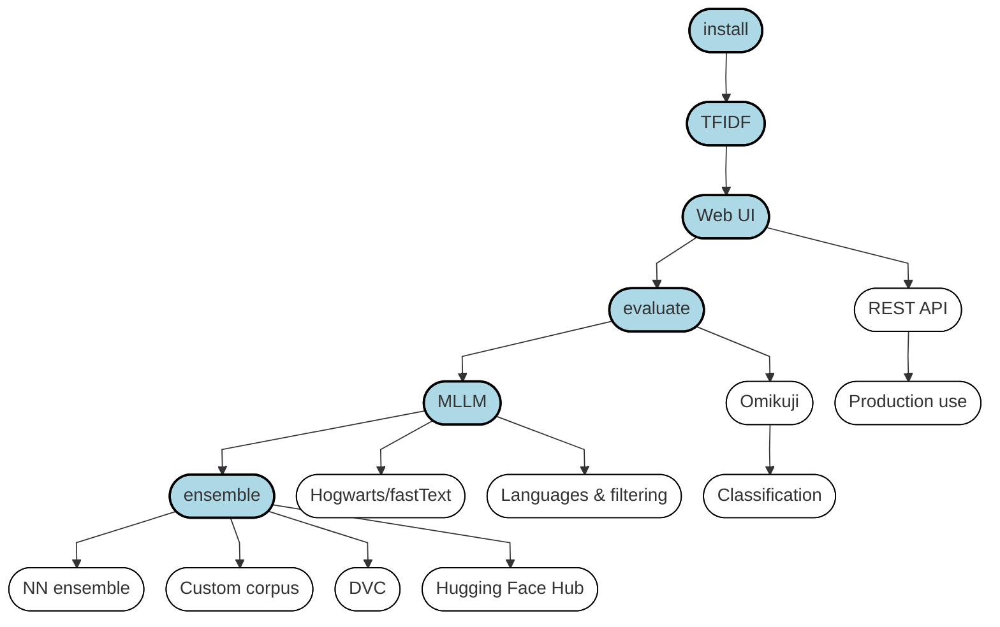

# Annif tutorial

The tutorial includes short **video presentatios** and **hands-on exercises**. 
Two example [data sets](data-sets) are provided to be used in the exercises.

The tutorial was initially organized at
[SWIB19](http://swib.org/swib19/programme.html) 
and later updated for other conferences and occasions, the materials are freely available for self-study; see the [excercises below](#exercises-and-videos).

## Prerequisites

You will need a computer with sufficient resources (at least 8GB RAM and 20GB free disk space) to be
able to install Annif and complete the exercises on your own computer. Installation of Annif is one topic of the exercises.

Note also that it might be convenient to have either Docker or VirtualBox
installed beforehand.

However, if you cannot install Annif on your own computer, you can use the GitHub Codespaces installation, which is described in [Exercise 1.2](exercises/01_install_annif.md#12-github-codespaces-install).
In this setup Annif will be running in a GitHub-hosted machine, which you will access via a remote terminal running in your browser. For this you are required to have an account on GitHub.

## Getting the tutorial materials

To complete the exercises of this tutorial, you will need a local copy of the materials,
especially the data sets (unless you use the pre-built VirtualBox VM, which
includes them).  The easiest way to get them is to either clone this
repository or download it as a zip archive from GitHub (click the green "Code" button near the top for clone and download options).

When you have the files locally, you also need to download the example
full text documents for either or both data sets. The downloads are automated using
`make` - see the README files for both data sets
([yso-nlf](data-sets/yso-nlf), [stw-zbw](data-sets/stw-zbw)) for details.

## Upcoming help sessions
From time to time, we organize (online or in-person) help sessions for people working on the tutorial exercises. To  register, you should have watched the videos and at least attempted to complete the exercises. Info will be posted here.

  * [SWIB24 conference online workshop/tutorial](https://swib.org/swib24/programme.html)
    * Nov 25th 2024
 
### Past help sessions

 
 
 See here 

 
* [Open Repositories 2024 in-person workshop/tutorial](https://or2024.openrepositories.org/program-registration/workshops-and-tutorials/w07/)
  * June 3th 2024, Göteborg, Sweden
 * [SWIB23 conference in-person workshop/tutorial](https://swib.org/swib23/programme.html)
   * September 11 2023
* [SWIB22 conference online workshop/tutorial](https://swib.org/swib22/)
  * November 30 2022
* [Annif bootcamp at ELAG](https://elag2022.lnb.lv/programme/bootcamps/#Osma_Suominen)
  * ELAG (European Library Automation Group) Conference is in Riga, Latvia (June 8-10 2022). More info: [https://elag2022.lnb.lv/](https://elag2022.lnb.lv/)
* [Les Futurs Fantastiques conference online workshop/tutorial](https://bnf-fr.zoom.us/meeting/register/tJ0vd-qsqTgvGdIOkl2aw4aJl3bOZ--x6zUm)
  * December 7 2021
* [SWIB21 conference online workshop/tutorial](https://swib.org/swib21/programme.html#abs104)
  * November 30 2021 
* [Baltic Summer School of Digital Humanities 2021: "Digital Methods in Humanities and Social Sciences"](https://www.nlib.ee/et/digital-humanities-tallinn-2021)
  * Annif online workshop August 25 2021     
* [Metadata workshop by Humlab (Umeå University)](https://www.umu.se/en/events/metadata-workshop_10407034/)
  * June 9 2021 (online)
* [Annif online tutorial / workshop (NB! Event in Finnish)](https://www.kiwi.fi/x/FwW5D)
  * May 19 2021 
* [SWIB20 online conference workshop/tutorial](https://swib.org/swib20/programme.html#abs05)
  * Tuesday November 24 2020 
* [DCMI Virtual post-conference tutorial](https://www.dublincore.org/news/2020/09-11-tutorial-on-automated-subject-indexing-with-annif/)
  * Friday October 9 2020 
  * Wednesday October 21 2020

---

# Exercises and videos 
Welcome to the actual Annif tutorial content. There are video-only lectures that are prefixed with :film_strip:.
Exercises marked with :computer: require some coding, and those with :book: are for reading only. NB! If you have problems with viewing the pdf files on GitHub, you can download them or e.g. try a different browser (see also [discussion about this problem](https://github.com/orgs/community/discussions/64419#)).

## :film_strip: Introduction and overview

- [slides](/presentations/intro-slides.pdf)
- [transcript of video](/transcripts/intro.md)
- [introduction to the Linux command line](/exercises/linux_command_line.md)

The exercises drawn with thick borders and a blue background are **core**, the
others are optional extras.

## :computer: 1. Installation

Select your installation type. If you don’t know what to choose, we suggest using VirtualBox.

 - [exercise with videos ➡️](/exercises/01_install_annif.md) 

## :film_strip: Data sets
This tutorial provides two example data sets; one of them should be chosen to be used in the exercises.
 
- [dataset intro with video ➡️](/exercises/data-sets.md)

## 💻 2. TFIDF project
The basic functionality of Annif is introduced by setting up and training a project using a TFIDF model.

- [exercise with video ➡️](/exercises/02_tfidf_project.md)

## 🎞️ Algorithms
The principles of the algorithm types used by Annif models are presented.

- [algorithms intro with video ➡️](/exercises/algorithms.md)

## :computer: 3. Web UI
The web user interface of Annif allows quick testing of projects.

- [exercise with video ➡️](/exercises/03_web_ui.md)

## 💻 [Optional] REST API
The REST API of Annif can be used for integrating Annif with other systems.
- [exercise ➡️](/exercises/OPT_rest_api.md)

## :book: [Optional] Production use
Here is described aspects to consider when going from testing and development phase to a production-ready deployment of Annif.
- [exercise](/exercises/OPT_production_use.md)

## :computer: 4. Metrics & evaluation
Quantitative testing and comparison of projects against standard metrics can be done using the `eval` command.

- [exercise with video ➡️](/exercises/04_evaluate.md)

## 💻 [Optional] Omikuji project
Omikuji is a tree-based associative machine learning model that often produces very good results, but requires more resources than the TFIDF model.
This exercise is optional, because training an Omikuji model on the full datasets can take around 40 minutes.
- [exercise ➡️](/exercises/OPT_omikuji_project.md)

## :computer: [Optional] Automated classification
Annif can also be used for multiclass classification, where the goal is to choose the correct class among mutually exclusive classes. This exercise demonstrates automated classification using the well known "Twenty Newsgroups" data set.

- [exercise ➡️](/exercises/OPT_classification.md)

## 💻 5. MLLM project
MLLM is a lexical algorithm for matching terms in document text to terms in a controlled vocabulary.
 
- [exercise with video ➡️](/exercises/05_mllm_project.md)

## :computer: [Optional] Hogwarts Sorting Hat using fastText
Yet another algorithm you can try is fastText, which can also work on the level of individual characters.
- [exercise ➡️](/exercises/OPT_hogwarts.md)

## :book: [Optional] Languages and filtering
The ability of Annif to process text in a given language depends on the choice of the analyzer, which performs text preprocessing.
Sometimes it might be useful to filter out parts of the document that are not in the main language of the document.
- [exercise ➡️](/exercises/OPT_langfilter.md)

## :computer: 6. Ensemble project
An ensemble project combines results from the projects set up in previous exercises.

- [exercise with video ➡️](/exercises/06_ensemble_project.md)

## :computer: [Optional] Neural network ensemble project
A neural network ensemble can be trained to intelligently combine the results from the base projects.

- [exercise ➡️](/exercises/OPT_nn_ensemble_project.md)

## 💻 [Optional] Custom corpus
A big challenge in applying Annif to own data is gathering documents and converting them to form a corpus in suitable format. In this exercise metadata from arXiv articles are used to form a corpus, which can be used to train Annif models.

- [exercise ➡️](/exercises/OPT_custom_corpus.md)
- [Jupyter Notebook ➡️](/data-sets/arxiv/create-arxiv-corpus.ipynb)

## :computer: [Optional] Data Version Control

Data Version Control (DVC) eases maintaining machine learning projects. In this exercise a DVC pipeline is used to set up, train and evaluate Annif projects.

- [exercise ➡️](/exercises/OPT_dvc.md)

## :computer: [Optional] Hugging Face Hub

🤗 Hugging Face is an ecosystem and collaboration platform for AI use and development. In this exercise ready-to-use Annif projects are downloaded from a Hugging Face Hub repository.

- [exercise ➡️](/exercises/OPT_huggingfacehub.md)

## :film_strip: Closing
Summary of the material in the tutorial and some pointers to further information.

- [slides](/presentations/closing-slides.pdf)
- [transcript of video](/transcripts/closing.md)
- [feedback](https://forms.gle/mBkk8eAufXUmbQ716)

---

## Authors

The tutorial material was created by:

* Osma Suominen, National Library of Finland
* Mona Lehtinen, National Library of Finland
* Juho Inkinen, National Library of Finland
* Anna Kasprzik, ZBW - Leibniz Information Centre for Economics
* Moritz Fürneisen, ZBW - Leibniz Information Centre for Economics

## License

The materials created for this tutorial (presentations and exercises) are
licensed under a [Creative Commons Attribution 4.0 International License][cc-by].

[![CC BY 4.0][cc-by-image]][cc-by]

The data sets were collected from other sources and have their own
licensing; see each individual data set for details.

[cc-by]: http://creativecommons.org/licenses/by/4.0/
[cc-by-image]: https://i.creativecommons.org/l/by/4.0/88x31.png
