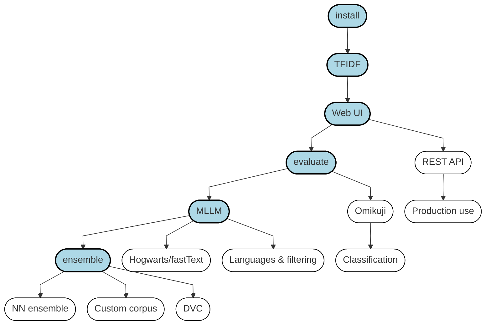

# Annif tutorial outline

## 1. Introduction and overview

- [slides](/presentations/intro-slides.pdf)
- [transcript of video](/transcripts/intro.md)
- [introduction to the Linux command line](/exercises/linux_command_line.md)

The exercises drawn with thick borders and a blue background are **core**, the
others are optional extras.

## 2. Installation

Select your installation type. If you don’t know what to choose, we suggest using VirtualBox.
- [exercise](/exercises/01_install_annif.md)

### 2.1. VirtualBox install

- [slides](/presentations/annif-install-virtualbox-slides.pdf)
- [transcript of video](/transcripts/annif-install-virtualbox.md)
- [VirtualBox image download (~2GB)](https://annif.org/download/)

### 2.2. Docker install

- [slides](/presentations/annif-install-docker-slides.pdf)
- [transcript of video](/transcripts/annif-install-docker.md)

### 2.3. Linux native install

- [slides](/presentations/annif-install-linux-slides.pdf)
- [transcript of video](/transcripts/annif-install-linux.md)
- [Annif README file with installation instructions](https://github.com/NatLibFi/Annif/blob/master/README.md)

## 3. Data sets
This tutorial provides two example data sets; one of them should be chosen to be used in the exercises.

- [slides](/presentations/data-sets-slides.pdf)
- [transcript of video](/transcripts/data-sets.md)

## 4. TFIDF project
The basic functionality of Annif is introduced by setting up and training a project using a TFIDF model.

- [slides](/presentations/tfidf-project-slides.pdf)
- [transcript of video](/transcripts/tfidf-project.md)
- [exercise](/exercises/02_tfidf_project.md)

## 5. Algorithms
The principles of the algorithm types used by Annif models are presented.

- [slides](/presentations/algorithms-slides.pdf)
- [transcript of video](/transcripts/algorithms.md)

#### [Optional]
Slides on associative algorithms for XMTC (by CSC's [@jmakoske](https://github.com/jmakoske) & [@mvsjober](https://github.com/mvsjober)):
- [Extreme multi-label text classification (XMTC)](/exercises/HPD-XMTC-2020-11-13.pdf)
- [Tree-based methods for XMTC](/exercises/HPD-TBM-2020-11-13.pdf)
- [Neural networks for XMTC](/exercises/HPD-NN-2020-11-13.pdf)

## 6. Web UI
The web user interface of Annif allows quick testing of projects.

- [slides](/presentations/web-ui-slides.pdf)
- [transcript of video](/transcripts/web-ui.md)
- [exercise](/exercises/03_web_ui.md)

## 7. [Optional] REST API
The REST API of Annif can be used for integrating Annif with other systems.
- [exercise](/exercises/07_rest_api.md)

## 8. Metrics & evaluation
Quantitative testing and comparison of projects against standard metrics can be done using the `eval` command.

- [slides](/presentations/metrics-and-evaluation-slides.pdf)
- [transcript of video](/transcripts/metrics-and-evaluation.md)
- [exercise](/exercises/04_evaluate.md)

## 9. [Optional] Omikuji project
Omikuji is a tree-based associative machine learning model that often produces very good results, but requires more resources than the TFIDF model.
This exercise is optional, because training an Omikuji model on the full datasets can take around 40 minutes.
- [exercise](/exercises/08_omikuji_project.md)

## 10. MLLM project
MLLM is a lexical algorithm for matching terms in document text to terms in a controlled vocabulary.
 

- [slides](/presentations/mllm-slides.pdf)
- [transcript of video](/transcripts/mllm.md)
- [exercise](/exercises/05_mllm_project.md)

## 11. [Optional] Hogwarts Sorting Hat using fastText
Yet another algorithm you can try is fastText, which can also work on the level of individual characters.
- [exercise](/exercises/09_hogwarts.md)

## 12. Ensemble project
An ensemble project combines results from the projects set up in previous exercises.

- [slides](/presentations/ensemble-project-slides.pdf)
- [transcript of video](/transcripts/ensemble-project.md)
- [exercise](/exercises/06_ensemble_project.md)

## 13. [Optional] Neural network ensemble project
A neural network ensemble can be trained to intelligently combine the results from the base projects.

- [exercise](/exercises/10_nn_ensemble_project.md)

## 14. [Optional] Custom corpus
A big challenge in applying Annif to own data is gathering documents and converting them to form a corpus in suitable format. In this exercise metadata from arXiv articles are used to form a corpus, which can be used to train Annif models.

- [exercise](/exercises/12_custom_corpus.md)
- [Jupyter Notebook](/data-sets/arxiv/create-arxiv-corpus.ipynb)

## 15. Closing
Summary of the material in the tutorial and some pointers to further information.

- [slides](/presentations/closing-slides.pdf)
- [transcript of video](/transcripts/closing.md)
- [feedback (2021)](https://forms.gle/CtXLHMiEQoBBVRu6A)
