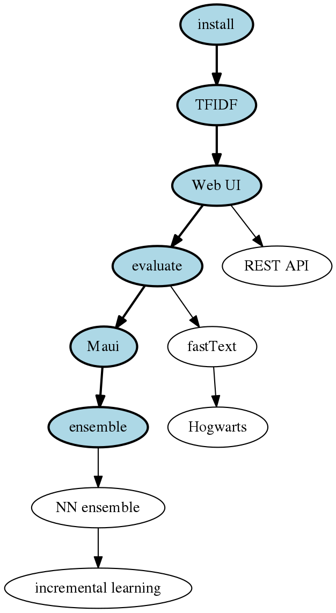

# Annif tutorial outline

## 1. Introduction and overview

- [slides](/presentations/intro-slides.pdf)
- [transcript of video](/transcripts/intro.md)

The exercises drawn with thick borders and a blue background are **core**, the
others are optional extras.

## 2. Installation
Select your installation type. If you don’t know what to choose, we suggest using VirtualBox.
- [exercise](/exercises/01_install_annif.md)

### 2.1. VirtualBox install

- [slides](/presentations/annif-install-virtualbox-slides.pdf)
- [transcript of video](/transcripts/annif-install-virtualbox.md)
- [VirtualBox image download (~2GB)](https://annif.org/download/)

### 2.2. Docker install

- [slides](/presentations/annif-install-docker-slides.pdf) **LINK TO BE ADDED**
- [transcript of video](/transcripts/annif-install-docker.md) **LINK TO BE ADDED**

### 2.3. Linux native install

- [slides](/presentations/annif-install-linux-slides.pdf)
- [transcript of video](/transcripts/annif-install-linux.md)
- [Annif README file with installation instructions](https://github.com/NatLibFi/Annif/blob/master/README.md)

## 3. Data sets
This tutorial provides two data sets; one of them should be chosen to be used in the exercises.

- [slides](/presentations/data-sets-slides.pdf)
- [transcript of video](/transcripts/data-sets.md)

## 4. TFIDF project
The basic functionality of Annif is introduced by setting up and training a project using a TFIDF model.

- [slides](/presentations/tfidf-project-slides.pdf)
- [transcript of video](/transcripts/tfidf-project.md)
- [exercise](/exercises/02_tfidf_project.md)

## 5. Algorithms
The principles of the algorithm types used by Annif models are presented.

- [slides](/presentations/algorithms-slides.pdf)
- [transcript of video](/transcripts/algorithms.md)

## 6. Web UI
The web user interface of Annif allows quick testing of projects.

- [slides](/presentations/web-ui-slides.pdf)
- [transcript of video](/transcripts/web-ui.md)
- [exercise](/exercises/03_web_ui.md)

## 7. [Optional] REST API
In the background the web UI uses the API of Annif, which can be accessed also directly.
- [exercise](/exercises/07_rest_api.md)

## 8. Metrics & evaluation
More quantitative testing and comparison of projects can be done based on metrics given by Annif's evaluation command.

- [slides](/presentations/metrics-and-evaluation-slides.pdf)
- [transcript of video](/transcripts/metrics-and-evaluation.md)
- [exercise](/exercises/04_evaluate.md)

## 9. [Optional] Omikuji project
The evaluation results of the TFIDF project can be compared for example to an Omikuji based project.
- [exercise](/exercises/08_omikuji_project.md)

## 10. Installing Maui Server
### 10.1. Docker

- [slides](/presentations/mauiserver-install-docker-slides.pdf)
- [transcript of video](/transcripts/mauiserver-install-docker.md)

### 10.2. Linux local install

- [slides](/presentations/mauiserver-install-linux-slides.pdf)
- [transcript of video](/transcripts/mauiserver-install-linux.md)

## 11. Maui project
Maui is a lexical algorithm for matching terms in document text to terms in a controlled vocabulary.

- [slides](/presentations/maui-project-slides.pdf)
- [transcript of video](/transcripts/maui-project.md)
- [exercise](/exercises/05_maui_project.md)

## 12. [Optional] Hogwarts Sorting Hat using fastText
Yet another algorithm you can try is fastText, which can dig into the character level of a text.
- [exercise](/exercises/09_hogwarts.md)

## 13. Ensemble project
An ensemble project combines results from the projects set up in previous exercises.

- [slides](/presentations/ensemble-project-slides.pdf)
- [transcript of video](/transcripts/ensemble-project.md)
- [exercise](/exercises/06_ensemble_project.md)

## 14. [Optional] Neural network ensemble project
Neural network ensemble can be trained to intelligently combine the results from the base projects. 

- [exercise](/exercises/10_nn_ensemble_project.md)

## 15. [Optional] Incremental learning
Neural network ensemble is also capable to online incremental learning, i.e. the training can be continued while the model is in use.

- [exercise](/exercises/11_incremental_learning.md)

## 16. Closing

- [slides](/presentations/closing-slides.pdf)
- [transcript of video](/transcripts/closing.md)
- [feedback]() **LINK TO BE ADDED**
